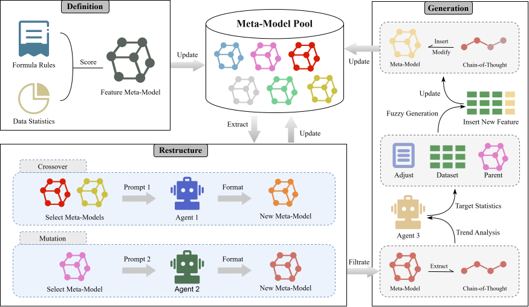

# FMM-Agent

FMM-Agent is an automated feature engineering framework for industrial imbalanced and high-dimensional classification. The central idea is to move feature evolution away from raw sample-level prompting and into a structured **Feature Meta-Model (FMM)** space. Each feature is represented by statistical descriptors, label-relevance indicators, distribution-stability signals, and a traceable generation rationale. LLMs then operate on these compact FMM descriptions to guide feature crossover, mutation, and fuzzy feature generation.

This repository accompanies the manuscript *FMM-Agent: Evolving Feature Meta-Models for Industrial Imbalanced Scenarios via LLMs*.



## Why FMM-Agent?

Industrial classification tasks often involve class imbalance, noise, and non-stationary distributions. Directly prompting LLMs with raw tabular samples is expensive, sensitive to noisy examples, and limited by context length. FMM-Agent instead compresses each feature into a statistical and semantic meta-model, allowing the LLM to reason over feature structure rather than raw instances.

## API Access URL of This Project

DeepSeek: https://platform.deepseek.com/

Chatgpt/Gemini/Claude: https://api2d.com/


## Method Overview

FMM-Agent follows a closed-loop feature evolution workflow.

1. **FMM Definition**
   Raw features are converted into FMMs. Each FMM records statistics such as mean, standard deviation, quantiles, skewness, kurtosis, missing rate, mutual information, information gain, score, lineage, operation chain, and generation round.

2. **FMM Restructure**
   LLM-guided crossover combines two parent FMMs, while LLM-guided mutation refines one parent FMM. The LLM operates under explicit prompt constraints and returns structured JSON metadata for a candidate offspring feature.

3. **Fuzzy Feature Generation**
   The offspring FMM rationale is translated into fuzzy transformation intentions. The code realizes those intentions through conservative numerical transformations, then recomputes the generated feature's statistics to keep metadata and data aligned.

4. **Screening and Evaluation**
   Candidate FMMs are scored and ranked. A knee-point screening strategy selects a compact feature subset without requiring a fixed top-k value or manually tuned score threshold. The selected features are evaluated with a class-balanced Random Forest classifier.

## Repository Structure

```text
FMM-Agent/
|-- configs/          # Runtime and LLM provider configuration
|-- Datasets/         # Example datasets for quick runs
|   `-- test_HD/      # UCI-style high-dimensional datasets
|-- images/           # README and paper-related figures
|-- operators/        # FMM scoring, selection, mutation, crossover, generation
|-- prompts/          # Fixed LLM prompt templates
|-- test/             # Lightweight tests and sample data
|-- utils/            # LLM client, config loader, logging, prompt loading
|-- logs/             # Runtime logs, ignored by git
|-- meta-info/        # Generated FMM metadata, ignored by git
|-- results/          # Metrics and summaries, ignored by git
|-- fmm_run.py        # Main experiment runner
|-- requirements.txt  # Pinned Python dependencies
`-- README.md
```

## Installation

Python 3.10 or newer is recommended.

```bash
cd FMM-Agent
pip install -r requirements.txt
```

The dependency versions are bounded in `requirements.txt` to make the public release easier to reproduce while avoiding stale lock-in.

## LLM API Configuration

FMM-Agent reads API keys from environment variables rather than storing credentials in config files.

```powershell
# Windows PowerShell
$env:DEEPSEEK_API_KEY="your_api_key"
```

```bash
# macOS/Linux
export DEEPSEEK_API_KEY="your_api_key"
```

Provider settings live in:

```text
configs/llm.yaml
```

The active provider is controlled by `data.model_choice`. Provider credentials are referenced through `api_key_env` fields in `configs/llm.yaml`; do not commit raw API keys.

## Quick Start

Run the bundled UCI-style high-dimensional datasets:

```bash
python fmm_run.py --mode HD
```

Run a short development check:

```bash
python fmm_run.py --mode HD --max-rounds 1 --early-stop-rounds 1
```

Useful command-line options:

```text
--config CONFIG                 Path to the YAML configuration file.
--mode {industry,test,HD}       Dataset mode to run.
--folds FOLDS                   Number of stratified CV folds.
--max-rounds MAX_ROUNDS         Maximum evolution rounds per fold.
--early-stop-rounds N           Stop after N rounds without BAC improvement.
--random-state RANDOM_STATE     Random seed for CV splitting.
```

## Prompts

All fixed prompts are stored in `prompts/`. The operator code loads these files and appends delimited JSON sections at runtime, keeping prompt wording separate from implementation logic.

| File | Purpose |
| --- | --- |
| `feature_mutation_system.txt` | System prompt for FMM mutation. |
| `feature_mutation_user.txt` | User prompt template for one parent FMM. |
| `feature_crossover_system.txt` | System prompt for FMM crossover. |
| `feature_crossover_user.txt` | User prompt template for two parent FMMs. |
| `trend_system.txt` | System prompt for fuzzy transformation planning. |
| `trend_user.txt` | User prompt template for parent-child FMM alignment. |
| `fmi_summary_system.txt` | System prompt for FMI summary generation. |
| `fmi_summary_user.txt` | User prompt template for summarizing selected metadata. |

## Outputs

Runtime artifacts are written to:

- `results/`: classification metrics and summary CSV files.
- `meta-info/`: feature meta-information generated during evolution.
- `logs/`: execution logs.

## Reproducibility Notes

- Use the same random seed when comparing runs.
- Keep the same LLM provider, model configuration, and prompt files for paper-style reproduction.
- For industrial datasets, merge the original train/test split before k-fold evaluation.
- For HD datasets, run stratified k-fold evaluation on each full dataset; the effective fold count is capped by the smallest class size when needed.


## Citation

```bibtex
@article{zhou2026fmmagent,
  title  = {FMM-Agent: Evolving Feature Meta-Models for Industrial Imbalanced Scenarios via LLMs},
  author = {Zhou, Yu and Lyu, Guanghua and Guo, Hainan and Kwong, Sam and Zhang, Qingfu},
  year   = {2026},
  note   = {Manuscript under revision for Frontiers of Engineering Management}
}
```

## License

This project is released under the MIT License.
